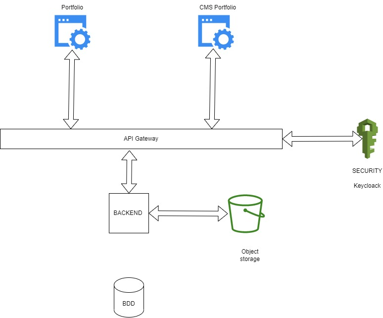
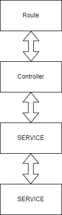

# DJMXCREATION portfolio (WIP)

This project its related to my portfolio for my art activities and IT.This project its the best way to practice. The main language is rust.
This backend was originally made in nodejs. 
It's a one man project so some choice have to be made for the economic purpose and the time consuming.  

## Architecture

Tis project is composed by 1 backend and 2 front end . A front dedicated to the CMS part and one for the portfolio website.

All detail is not decided yet but here the technical stack :

- IAAS No cloud provider but a private cloud:
i intend to use cloudhypervisor, its easy to use light and give a full control on the infrastructure.
https://www.cloudhypervisor.org/
https://github.com/cloud-hypervisor/cloud-hypervisor

- PASS maybe kubernetes will be use but lately i started to experiment some wasm platform like wasmCloud. *
  That why a refactoring of the code was made . It will be easier to try some new tool without the pain.

- Object storage: for the cost of the project i don't intent to use AWS-S3 but a S3 like
  2 Solutions is studied:
  Minio: https://min.io/
  i used minio because the experience i have with .
  Seaweedfs: https://github.com/seaweedfs/seaweedfs
   on paper it's the most attractive but i didn't try it yet . But i will probably be the final choice.

## Project architecture

For my project i decided to go for a Service-oriented Architecture SOA. 
Its easy to reuse some part of the component for the different tool without too much effort.

  SOA will not be use in a dogmatic way . For example in this project there is a package app-domain , this package has the view and the entity representing the data. I made the choice to make them together to reuse them in other project like the frontend portfolio and cms. Fow now the backend framework used is WARP but AXUM and ACTIX ( i will not talk about WASMER and wasmcloud for now) .
  So for now all layers are aware of the app-domain lib.In the SOA architecture it should not be the case but i prefer to stay pragmatic to simply the system.

  ## APP Security

  Because the of the cost and some infrastructure complexity i will use and api-key to secure all endpoint on top of it an api-gateway will be use. only the api gateway will be aware of this api-key

  The other aspect of the security will be handle by keycloak and the api-gateway. if i decide to change only the api-gateway will be impacted.. 

This project is still in progress .

### TODO LIST

- [] Add migration library
- [] Add a backend for AXUM
- [] Add a backend for ACTIX
- [] implement wasmcloud
- [] implement wasmer
- [] fix app-error( make it more oriented business , remove error from warp and sqlx)
- [] add test using test-container
- [] add observability
- [] add CICD
- [] add documentation

